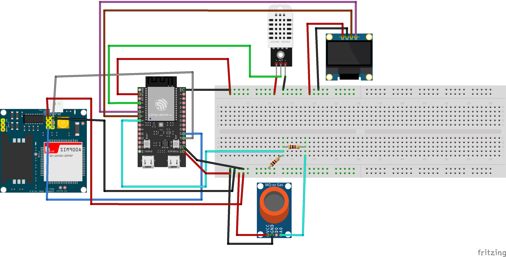
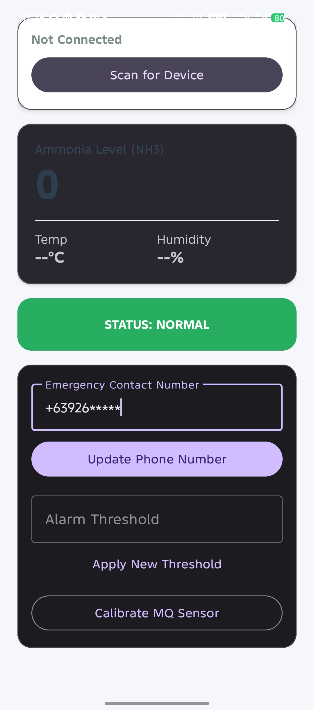

# AmmoniaMonitor

A real-time ammonia gas monitoring system built on an ESP32 microcontroller with a companion Android app. Sensor readings are streamed over BLE (Bluetooth Low Energy) and an SMS alert is sent via a SIM900 GSM module when gas levels exceed a configurable threshold.

---

## Table of Contents

- [System Overview](#system-overview)
- [Hardware & App Preview](#hardware--app-preview)
- [Hardware Components](#hardware-components)
- [Wiring / Pin Reference](#wiring--pin-reference)
- [Firmware Setup](#firmware-setup)
- [Android App Setup](#android-app-setup)
  - [Permissions & Bluetooth](#permissions--bluetooth)
- [Usage](#usage)
- [UUID Reference — Read Before Modifying Code](#uuid-reference--read-before-modifying-code)
- [Project Structure](#project-structure)
- [Troubleshooting](#troubleshooting)

---

## System Overview

```
┌──────────────────────────────────────────┐
│              ESP32 Firmware              │
│                                          │
│  MQ Sensor ──► NH3 Level                │
│  DHT22     ──► Temp / Humidity           │
│  OLED      ◄── Status Display            │
│  SIM900    ──► SMS Alert                 │
│  BLE       ◄──► Android App             │
└──────────────────────────────────────────┘
```

The ESP32 advertises itself as `AmmoniaMonitor` over BLE. The Android app scans for this device name, connects automatically, and subscribes to notifications for gas level, temperature, humidity, and alert status. The app also lets you write back a phone number, alarm threshold, and trigger sensor calibration.

---

## Hardware & App Preview

### Wiring Diagram



### Android App

<p align="center">
  
</p>

---

## Hardware Components

| Component | Purpose |
|---|---|
| ESP32 (ESP32-WROOM) | Main microcontroller |
| MQ-xx Gas Sensor | Ammonia / gas detection |
| DHT22 (AM2302) | Temperature & humidity sensor |
| SH1106 128×64 OLED | On-device status display |
| SIM900A GSM Module | SMS alerts |
| 3.7V LiPo or 5V USB | Power supply |

---

## Wiring / Pin Reference

| Signal | ESP32 GPIO |
|---|---|
| I2C SDA (OLED) | 6 |
| I2C SCL (OLED) | 7 |
| DHT22 Data | 4 |
| MQ Sensor Analog (AO) | 0 |
| SIM900 TX | 2 |
| SIM900 RX | 3 |

> These are defined at the top of `firmware/esp32/main_ble/main_ble.ino`. Change them there if your wiring differs.

---

## Firmware Setup

1. Install [Arduino IDE](https://www.arduino.cc/en/software) or [PlatformIO](https://platformio.org/).

2. Install the required libraries via the Arduino Library Manager:
   - `U8g2` — OLED display driver
   - `DHT sensor library` — by Adafruit
   - `ESP32 BLE Arduino` — included with the ESP32 board package

3. Install the ESP32 board package:
   - Go to **File → Preferences → Additional Boards Manager URLs** and add:
     ```
     https://raw.githubusercontent.com/espressif/arduino-esp32/gh-pages/package_esp32_index.json
     ```
   - Then install **esp32 by Espressif Systems** from **Tools → Board → Boards Manager**.

4. Open `firmware/esp32/main_ble/main_ble.ino`.

5. Select your board (e.g., **ESP32 Dev Module**) and the correct COM port, then click **Upload**.

6. Open Serial Monitor at **115200 baud** to verify startup messages.

---

## Android App Setup

### Requirements

- Android **7.0 (API 24)** or higher
- Bluetooth LE capable device
- Android Studio **Hedgehog** or later (for building from source)

### Building

```bash
cd app
./gradlew assembleDebug
```

The APK will be output to `app/app/build/outputs/apk/debug/app-debug.apk`.

### Permissions & Bluetooth

> ⚠️ **The app will not function without completing all of the steps below.**

#### 1. Turn On Bluetooth

Before opening the app, go to your phone's **Settings → Bluetooth** and make sure Bluetooth is **turned ON**.

#### 2. Grant All Requested Permissions

When you first launch the app, Android will prompt you for the following permissions. **Allow every one of them:**

| Permission | Why it's needed |
|---|---|
| **Nearby devices** (BLUETOOTH_SCAN, BLUETOOTH_CONNECT) | Required to scan for and connect to the ESP32 over BLE |
| **Location** (ACCESS_FINE_LOCATION) | Required by Android for BLE scanning on API level < 31 |

> On Android 12 and above, the "Nearby devices" prompt covers all Bluetooth permissions. On older versions you will also see a separate Location permission prompt — this is a normal Android requirement for BLE and does **not** mean the app tracks your GPS location.

If you accidentally denied a permission:
1. Go to **Settings → Apps → Sensor → Permissions**.
2. Enable **Nearby devices** and **Location**.
3. Restart the app.

---

## Usage

1. Power on the ESP32 hardware.
2. Open the **Sensor** app on your Android device.
3. Tap **Scan for Device** — the app will automatically find `AmmoniaMonitor` and connect.
4. Once connected, live readings appear for **NH3 level**, **temperature**, and **humidity**.
5. The status banner turns **red** when the gas level exceeds the threshold, and an SMS is dispatched to the configured contact number.

### Setting an Emergency Contact

1. Enter a phone number in the **Emergency Contact Number** field (include country code, e.g. `+639XXXXXXXXX`).
2. Tap **Update Phone Number**. The number is saved to both the app's local storage and the ESP32's flash memory — it persists across power cycles.

### Changing the Alarm Threshold

1. Enter a raw ADC value in the **Alarm Threshold** field.
2. Tap **Apply New Threshold**. The new value is written to the ESP32 and saved to flash.

> The default threshold is **2500** (raw ADC). Adjust based on your sensor and environment.

### Calibrating the MQ Sensor

1. Place the sensor in **clean air**.
2. Tap **Calibrate MQ Sensor**. The ESP32 will recalculate the baseline R0 value.

---

## UUID Reference — Read Before Modifying Code

> ⚠️ **Critical:** The UUIDs defined in the firmware and in the Android app **must match exactly at all times.** If you change a UUID in one place, you must update it in the other as well — a mismatch will cause the app to silently fail to read or write that characteristic.

| Characteristic | UUID |
|---|---|
| BLE Service | `12345678-1234-1234-1234-123456789abc` |
| Gas / NH3 Level | `12345678-1234-1234-1234-123456789ab1` |
| Temperature | `12345678-1234-1234-1234-123456789ab2` |
| Humidity | `12345678-1234-1234-1234-123456789ab3` |
| Alert Status | `12345678-1234-1234-1234-123456789ab4` |
| Alarm Threshold (write) | `12345678-1234-1234-1234-123456789ab5` |
| Calibrate (write) | `12345678-1234-1234-1234-123456789ab6` |
| R0 Value (read) | `12345678-1234-1234-1234-123456789ab7` |
| Phone Number (write) | `12345678-1234-1234-1234-123456789ab8` |

UUIDs are defined in:
- **Firmware:** `firmware/esp32/main_ble/main_ble.ino` — top-level `#define` blocks
- **Android:** `app/app/src/main/java/com/example/sensor/MainActivity.kt` — UUID fields at the top of `MainActivity`

---

## Project Structure

```
.
├── app/                        # Android app (Kotlin)
│   ├── app/src/main/
│   │   ├── java/com/example/sensor/
│   │   │   └── MainActivity.kt     # BLE logic + UI
│   │   ├── res/layout/
│   │   │   └── activity_main.xml   # App layout
│   │   └── AndroidManifest.xml     # Permissions
│   └── build.gradle.kts
│
├── firmware/
│   └── esp32/
│       └── main_ble/
│           └── main_ble.ino        # ESP32 firmware
│
├── wiring_photo.png            # Fritzing wiring diagram
├── app_photo.jpg               # Android app screenshot
└── README.md
```

---

## Troubleshooting

| Problem | Fix |
|---|---|
| App shows "Searching..." forever | Make sure the ESP32 is powered on and advertising. Confirm Bluetooth is enabled and all permissions are granted. |
| Connected but no readings update | Verify the UUIDs in the app and firmware match exactly (see UUID Reference above). |
| SMS not sent | Confirm the SIM card is inserted, has SMS credit, and the stored number includes the country code. Check SIM900 wiring on GPIO 2 & 3. |
| OLED shows garbled text | Check I2C wiring — SDA on GPIO 6, SCL on GPIO 7. |
| Threshold resets after power cycle | Ensure `prefs.putInt("threshold", ...)` is present in `ThresholdCallbacks::onWrite` in the firmware. Note: there is a duplicate `ThresholdCallbacks` class in the firmware — remove the first one (the one without `prefs.putInt`) or the project will fail to compile. |
| App crashes on launch | Grant all permissions manually via **Settings → Apps → Sensor → Permissions**. |
